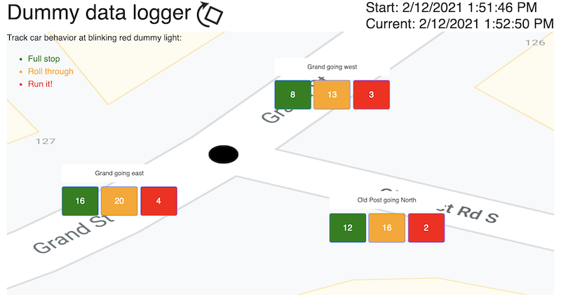

# Dummy Light Data Logger
A simple data logger to track cars stopping, rolling, and running through the stop sign/traffic light at the "dummy light" in the village of Croton-on-Hudson, New York.

## Try it out
The app is available online at https://croton-on-hudson.github.io/dummy-light-data-logger/.
## How to use
Click buttons to log cars stopping, rolling, or running through the blinking red dummy light in each direction.

Rotate the map to match your vantage point on the street.

The app is intended to be used in landscape mode on a phone or tablet, but works on desktop as well.  The app does not save any data, so just take a screenshot or write down the data whenever you’re done.

